# State

> Last updated: 2026-06-25
> See `HANDOFF.md` for the full session wrap-up and resume instructions.

## System state diagram

```mermaid
stateDiagram-v2
    [*] --> Spec: spec written
    Spec --> Planning: read spec, lock decisions
    Planning --> Building: 12 decisions locked, plan persisted
    Building --> Testing: all 11 steps complete
    Testing --> Deploying: tests pass + security review
    Deploying --> Live: Caddy + Tunnel routes openorg.good-ship.co.uk
    Live --> Hardening: bug sweep + styling + graph discovery + Claude skills
    Hardening --> [*]: branch pushed, PR pending

    note right of Hardening: ← WE ARE HERE (12 commits on fix/openorg-hardening, pushed; PR to be opened)
```



## Component status

| Step | Component | Status | Notes |
|------|-----------|--------|-------|
| 0 | Schemas + theme vocab + validator | ✅ Done | 30-theme vocab, three v0.1 schemas, jsonschema-Draft202012 validator wrapper |
| 1 | Markdown ↔ JSON converter | ✅ Done + hardened | Round-trip identity; code-block masking, priority parsing, plain-bullet parsing, numeric type coercion added |
| 2 | DB models + Alembic migration | ✅ Done | 8 models with structural tests |
| 3 | CachedAnthropic + llm_usage logging | ✅ Done | Provider-neutral (Anthropic/OpenRouter/Ollama) |
| 4 | Markdown editor UI + magic-link auth | ✅ Done | Dual-surface (guided + markdown), autosave, PublishStrip, live generate status |
| 5 | Profile generator | ✅ Done | CC + website crawl + analyzer + theme extractor + mission rewriter + ONS lookup |
| 6 | Murmurations schema upstream PR | ⚠️ User action needed | Schema + reference profile drafted at `deploy/murmurations/` |
| 7 | Murmurations connector + postcodes.io | ✅ Done + hardened | Health-check crash fixed, publish-before-validate guard added |
| 8 | Strategy/idea chat creator | ✅ Done + hardened | SSE error handling, DOCX table/header/footer extraction, priorities/learning data-loss fix |
| 9 | Discovery page | ✅ Done + enhanced | List+Map view + **new Graph view** (D3 force-directed, nodes/edges, hover, click-to-detail) |
| 10 | Subdomain routing + Caddy | ✅ Done | Caddyfile dual site blocks; Layout.tsx hostname-aware (editorial chrome on openorg.*) |
| 11 | Real-world testing harness | ✅ Done + baselined | 10 UK charities baseline run |
| 12 | Claude skills (/org-strategy, /org-idea) | ✅ Done | SKILL.md files with full conversational flows, schema refs, theme vocab |
| 13 | Design system alignment | ✅ Done | Sage + navy tokens, 11 button hover leaks fixed, emerald→sage, editorial Layout chrome |
| 14 | Graph data API | ✅ Done | `GET /api/open-org/graph` — nodes (orgs/ideas/strategies) + edges (ownership/shared themes/shared areas) |

Status markers: ⏳ not started · 🔧 in progress · ✅ done · 🚫 blocked · ⚠️ needs attention

## Test counts (2026-06-25)

| Suite | Count | Notes |
|-------|-------|-------|
| Core (pytest) | 314 | Was 299; +15 converter/extractor edge-case tests |
| API (pytest) | 216 | Was 0 (blocked by Settings extra='forbid'); now all collecting + passing |
| Web (vitest) | 171 | Was 166; +5 GraphDiscovery tests |
| tsc | clean | |
| eslint | clean | |

## Data flow (target)

```mermaid
flowchart LR
    CN[Charity number] --> Gen[Profile generator]
    Gen -->|reuses| CC[CC enricher]
    Gen -->|LLM rewrite| Anthro[LLM provider]
    Gen --> MD[markdown_source]
    MD -->|converter| JSON[profile_json]
    JSON --> Public[/open-org/{org_id}/profile.json]
    Public --> Murm[Murmurations index]
    Murm --> Disc[Discovery page]
    Murm --> Graph[Graph view]
    MD --> Editor[Markdown editor]
    Editor -->|save| MD
```

## Dependencies

| Dependency | Status | Notes |
|---|---|---|
| Postgres 15 | ✅ via docker-compose | |
| Redis 7 | ✅ via docker-compose | |
| Charity Commission API | ✅ key wired | Existing enricher returns full data |
| LLM provider | ✅ Anthropic/OpenRouter/Ollama | Swappable via LLM_PROVIDER/LLM_MODEL env vars |
| Resend (magic links) | ✅ existing | New sender `hello@openorg.good-ship.co.uk` needs domain verification |
| postcodes.io | ✅ wired | Free public API |
| Murmurations index | ✅ test-index default | Flip via env vars when upstream schema PR merges |
| Caddy | ✅ both site blocks configured | `llmstxt.social` + `openorg.good-ship.co.uk` |
| Cloudflare Tunnel | ⚠️ user action | Add route for `openorg.good-ship.co.uk` |
| D3 (graph view) | ✅ installed | `d3` + `@types/d3` added to web package |

## Outstanding user actions

- **Open PR** for `fix/openorg-hardening` → https://github.com/dataforaction-tom/llmstxt-social/pull/new/fix/openorg-hardening
- **Murmurations schema upstream PR** — schema drafted at `deploy/murmurations/`
- **Cloudflare Tunnel route** for `openorg.good-ship.co.uk`
- **Resend domain verification** for `hello@openorg.good-ship.co.uk`
- **Prod image rebuild + deploy** — stale image needs rebuild (new `openai` dep + D3 dep)
- **Editor polish PR 7** (keyboard + motion polish) — still outstanding